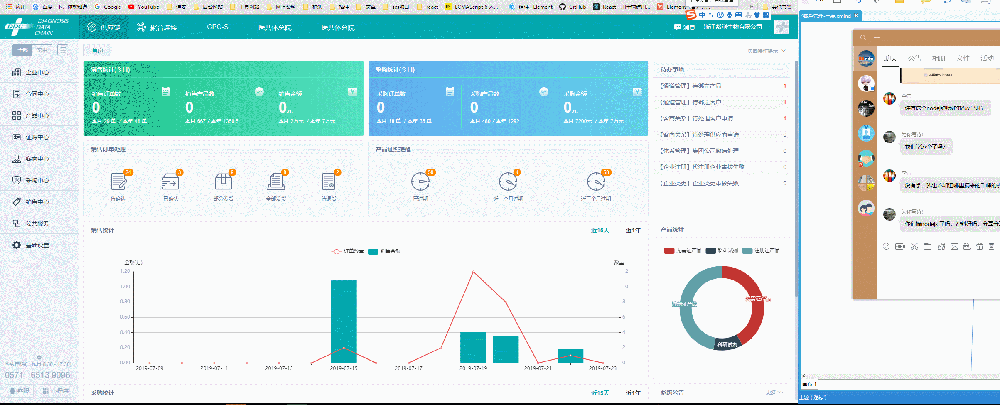

# 权限篇

> 后台系统，需求是菜单权限，按钮权限需要动态化，且可以在平台端实现可配置化，包括菜单名称，菜单的层级，菜单图标，挂载的模块，都可以随意配置，动态显示。

>我们的菜单分为四级，一级菜单表示应用，如（供应链，SPD，）是一些大的应用，scs相当于多个系统翻集合，一个容器，类似于微信，可挂载N个小程序，其他以下就是显示的左边菜单。二级算是大模块（采购，发货，企业入驻，证照管理等），三级是模块下面的一个分类，四级是真正对应的某个模块；

* 如下图显示（假图，哈哈哈~）





## 效果展示

## 代码设计
1.利用vue-router中的beforeEach实现权限列表加载
```js
// register global progress.
const whiteList=['/login', '/register', '/perfectRegister', '/basic/enterprise']
router.beforeEach((to, from, next) => {
    if ( whiteList.includes(to.path) || /^\/static/g.test(to.path)) { //如果是白名单中的就可以直接跳转进该页面
        next();
    } else {
        if (!store.getters.menuList) { //查看store中是否存在menuList
            // 判断当前用户是否登陆
            store.dispatch('currentUser').then(() => {
                // 没有登陆 跳到登陆页 what
                let user = store.getters.userInfo;
                if (!user || !user.enterpriseNo) {
                    next('/login');
                    return;
                }

               
                store.dispatch('getUserMenus').then(res => { // 权限不存在,获取权限
                    store.dispatch('generateRouters', res).then(list => { //生产菜单list
                        let app = [{ //将所有的页面都放到layout下，作为子组件
                            path: '',
                            component: Layout,
                            name: 'root',
                            children: list
                        }];
                        router.addRoutes(app); // 必须是数组,动态添加可访问路由表
                        next({ ...to }); // hack方法 确保addRoutes已完成
                    });
                }).catch(errs => {
                    console.info(errs);
                    // 无法获取权限则跳到登入页,无权限进入系统
                    next('/login');
                });
            });
        } else if (to.matched.length) { //有元信息直接进入 
            next();
        } else {
            next('/app/hello');
        }
    }
});
```
>这部分是全局路由拦截,跳转页面之前做的一些事,获取动态裁单

## 权限返回数据类型
<details>
<summary>权限数据</summary>

```js
{
	"apiName":"员工登陆后，获取该员工菜单按钮权限",
	"code":"SUCCESS",
	"data":{
		"menuList":[
			{
				"parentNo":".0.",
				"permissionType":"APP",
				"no":"0000096",
				"permissionUrl":"/scm/",
				"appCode":"SCM-C",
				"label":"供应链",
				"path":"/scm/",
				"children":[
					{
						"parentNo":"0000096",
						"permissionType":"MODEL",
						"no":".0.002323.",
						"funcIcon":"icon-zuoce-qiyeguanli",
						"permissionUrl":"enterprise",
						"basicPermissionNo":".0.000003.",
						"label":"企业中心",
						"path":"/scm/enterprise",
						"children":[
							{
								"parentNo":".0.002323.",
								"permissionType":"MODEL",
								"no":".0.002323.000001.",
								"funcIcon":"icon-zhunbeiliangchan",
								"permissionUrl":"/",
								"basicPermissionNo":".0.000003.000002.",
								"label":"企业信息",
								"path":"/scm//",
								"children":[
									{
										"parentNo":".0.002323.000001.",
										"permissionType":"MENU",
										"no":".0.002323.000001.000001.",
										"funcIcon":"icon-daohang-ji",
										"permissionUrl":"basic/enterprise/account",
										"basicPermissionNo":".0.000003.000002.000081.",
										"label":"我的账户",
										"path":"/scm/basic/enterprise/account",
										"checked":false,
										"permissionNo":".0.000081.",
										"permissionCodes":"scs.ecs.enterprise.findEnterpriseDetailByEnterpriseNoForSystem,ddc.uim.userAccount.updatepassword,ddc.uim.userAccount.updatemobile,ddc.uim.userAccount.updateemail,ddc.uim.userAccount.checkpassword,demo.order.selectByPK",
										"permissionCode":"menu_ddc_uim_account_user_account",
										"pageTips":"",
										"releaseNo":"0000096"
									},
									{
										"parentNo":".0.002323.000001.",
										"permissionType":"MENU",
										"no":".0.002323.000001.000002.",
										"funcIcon":"icon-daohang-ji",
										"permissionUrl":"basic/enterprise/info",
										"basicPermissionNo":".0.000003.000002.000082.",
										"label":"基本资料",
										"path":"/scm/basic/enterprise/info",
										"checked":false,
										"permissionNo":".0.000082.",
										"permissionCodes":"scs.ecs.enterprise.findEnterpriseDetailByEnterpriseNo,sdc.certRule.findList",
										"permissionCode":"menu_ddc_ecs_audited",
										"pageTips":"",
										"releaseNo":"0000096"
									},
									{
										"parentNo":".0.002323.000001.",
										"permissionType":"MENU",
										"no":".0.002323.000001.000003.",
										"funcIcon":"icon-daohang-ji",
										"permissionUrl":"basic/enterprise/address",
										"basicPermissionNo":".0.000003.000002.000083.",
										"label":"收货地址",
										"path":"/scm/basic/enterprise/address",
										"checked":false,
										"permissionNo":".0.000083.",
										"permissionCodes":"ddc.ecs.enterpriseShippingAddress.get,ddc.ecs.enterpriseShippingAddress.findList",
										"permissionCode":"menu_ddc_ecs_shipping_addr",
										"pageTips":"",
										"releaseNo":"0000096"
									},
									{
										"parentNo":".0.002323.000001.",
										"permissionType":"MENU",
										"no":".0.002323.000001.000004.",
										"funcIcon":"icon-daohang-ji",
										"permissionUrl":"basic/enterprise/bill",
										"basicPermissionNo":".0.000003.000002.000084.",
										"label":"发票助手",
										"path":"/scm/basic/enterprise/bill",
										"checked":false,
										"permissionNo":".0.000084.",
										"permissionCodes":"ddc.ecs.enterpriseInvoiceManager.findList,ddc.ecs.enterpriseInvoiceManager.get",
										"permissionCode":"menu_ddc_ecs_invoice",
										"pageTips":"",
										"releaseNo":"0000096"
									}
								],
								"checked":false,
								"permissionNo":".0.000003.000002.",
								"permissionCodes":"",
								"permissionCode":"corp_info",
								"releaseNo":"0000096"
							},
							{
								"parentNo":".0.002323.",
								"permissionType":"MODEL",
								"no":".0.002323.000002.",
								"funcIcon":"icon-zhunbeiliangchan",
								"permissionUrl":"/",
								"basicPermissionNo":".0.000003.000004.",
								"label":"岗位权限",
								"path":"/scm//",
								"children":[
									{
										"parentNo":".0.002323.000002.",
										"permissionType":"MENU",
										"no":".0.002323.000002.000001.",
										"funcIcon":"icon-daohang-ji",
										"permissionUrl":"permissions/account",
										"basicPermissionNo":".0.000003.000004.000033.",
										"label":"账号管理",
										"path":"/scm/permissions/account",
										"checked":false,
										"permissionNo":".0.000033.",
										"permissionCodes":"ddc.uim.userAccount.check,ddc.uim.userAccount.get,ddc.uim.userAccount.findListPage",
										"permissionCode":"menu_ddc_uim_account",
										"pageTips":"",
										"releaseNo":"0000096"
									},
									{
										"parentNo":".0.002323.000002.",
										"permissionType":"MENU",
										"no":".0.002323.000002.000002.",
										"funcIcon":"icon-daohang-ji",
										"permissionUrl":"permissions/staff",
										"basicPermissionNo":".0.000003.000004.000034.",
										"label":"员工管理",
										"path":"/scm/permissions/staff",
										"checked":false,
										"permissionNo":".0.000034.",
										"permissionCodes":"ddc.uim.employee.ptenterlist,ddc.uim.employee.get,ddc.uim.employee.update,ddc.uim.employee.findList,ddc.uim.employee.findListPage,ddc.uim.employeeGroup.get,ddc.uim.employeeGroup.save,ddc.uim.employeeGroup.findList,ddc.uim.employeeGroup.findListPage,ddc.uim.employee.listNotUserNo,ddc.uim.employeeGroup.listByGroup",
										"permissionCode":"menu_ddc_uim_employee",
										"pageTips":"",
										"releaseNo":"0000096"
									},
									{
										"parentNo":".0.002323.000002.",
										"permissionType":"MENU",
										"no":".0.002323.000002.000003.",
										"funcIcon":"icon-daohang-ji",
										"permissionUrl":"permissions/role",
										"basicPermissionNo":".0.000003.000004.000035.",
										"label":"角色管理",
										"path":"/scm/permissions/role",
										"checked":false,
										"permissionNo":".0.000035.",
										"permissionCodes":"ddc.uim.group.get,ddc.uim.group.update,ddc.uim.group.save,ddc.uim.group.findList,ddc.uim.group.findListPage,ddc.uim.group.remove,ddc.uim.group.findCheckedGroupList,ddc.uim.group.checkName",
										"permissionCode":"menu_ddc_uim_group",
										"pageTips":"",
										"releaseNo":"0000096"
									},
									{
										"parentNo":".0.002323.000002.",
										"permissionType":"MENU",
										"no":".0.002323.000002.000004.",
										"funcIcon":"icon-daohang-ji",
										"permissionUrl":"permissions/system",
										"basicPermissionNo":".0.000003.000004.000105.",
										"label":"集团管理",
										"path":"/scm/permissions/system",
										"checked":false,
										"permissionNo":".0.000105.",
										"permissionCodes":"ddc.uim.enterpriseSystem.findListPage",
										"permissionCode":"menu_ddc_ecs_corpsystem_manager",
										"pageTips":"",
										"releaseNo":"0000096"
									}
								],
								"checked":false,
								"permissionNo":".0.000003.000004.",
								"permissionCodes":"",
								"permissionCode":"group_auth",
								"releaseNo":"0000096"
							}
						],
						"checked":false,
						"permissionNo":".0.000003.",
						"permissionCodes":"",
						"permissionCode":"enterprise_center",
						"releaseNo":"0000096"
					}
				],
				"checked":false,
				"releaseNo":"0000096"
			},
		],
		"permissionList":[
			{
				"permissionType":"BUTTON",
				"permissionUrl":"/",
				"basicPermissionNo":".0.000127.000001.000128.000128.000001.",
				"apiCodes":"ddc.openlink.apiPre.remove",
				"parentBasicPermissionNo":".0.000127.000001.000128.",
				"parentObjNo":".0.002312.000001.000001.",
				"sortNum":1,
				"permissionNo":".0.000128.000001.",
				"permissionCode":"btn_ddc_openlink_apipre_remove",
				"pageTips":"",
				"releaseNo":"0000102",
				"permissionName":"删除"
			},
			{
				"permissionType":"BUTTON",
				"permissionUrl":"/",
				"basicPermissionNo":".0.000127.000001.000128.000128.000002.",
				"apiCodes":"ddc.openlink.TSgpServiceApi.getOpenApi,ddc.openlink.TSgpServiceApi.getApiDetail",
				"parentBasicPermissionNo":".0.000127.000001.000128.",
				"parentObjNo":".0.002312.000001.000001.",
				"sortNum":1,
				"permissionNo":".0.000128.000002.",
				"permissionCode":"btn_ddc_openlink_apipre_view",
				"pageTips":"",
				"releaseNo":"0000102",
				"permissionName":"查看"
			},
			{
				"permissionType":"BUTTON",
				"permissionUrl":"/",
				"basicPermissionNo":".0.000127.000001.000129.000129.000001.",
				"apiCodes":"ddc.openlink.connectorApply.getKf",
				"parentBasicPermissionNo":".0.000127.000001.000129.",
				"parentObjNo":".0.002312.000001.000002.",
				"sortNum":1,
				"permissionNo":".0.000129.000001.",
				"permissionCode":"btn_ddc_openlink_connectorapply_view",
				"pageTips":"",
				"releaseNo":"0000102",
				"permissionName":"查看"
			},
			{
				"permissionType":"BUTTON",
				"permissionUrl":"/",
				"basicPermissionNo":".0.000127.000001.000129.000129.000002.",
				"apiCodes":"ddc.openlink.connectorApply.getKf,ddc.openlink.connectorApply.updateKf",
				"parentBasicPermissionNo":".0.000127.000001.000129.",
				"parentObjNo":".0.002312.000001.000002.",
				"sortNum":1,
				"permissionNo":".0.000129.000002.",
				"permissionCode":"btn_ddc_openlink_connectorapply_edit",
				"pageTips":"",
				"releaseNo":"0000102",
				"permissionName":"编辑"
			}
		]
	},
	"apiCode":"ddc.uim.authorizationPermission.getEmployeeAppPermission",
	"message":"SUCCESS"
}
 ```

</details>

> 具体查看 (./mock/permission.json)


## store中的处理
<details>
<summary>filterAsyncRouter</summary>

```js
import { constantRouterMap } from '@/router/router';
import BASE from '@/utils/constant/index.js';
/**
 * 递归过滤异步路由表，返回符合用户角色权限的路由表
 * @param routers
 * @param leval 递归层级
 */
const filterAsyncRouter = (routers, leval = 1) => {
    let asyncRouterMap = routers.map(item => {
        let permissionUrl = item.permissionUrl.split('?'); //处理组件地址
        item.path = item.path.split('?')[0] || 'app/404';  //href地址
        item.name = BASE.pageNames[permissionUrl[0]] || (permissionUrl[0] + item.no); //处理name,保证不唯一
        item.meta = {
            name: item.label,
            componentUrl: permissionUrl[0],
            no: item.no,
            pageTips: item.pageTips || '',
            query: permissionUrl[1],
            leval: leval, //表示级别,二级模块显示会有所区别
            cache: BASE.cacheUrls.includes(item.permissionUrl) //是否要缓存,于前端config配置做对比
        };
        BASE.pageNames[permissionUrl[0]] = false;
        (item.children && item.children.length) && (item.children = filterAsyncRouter(item.children, leval + 1));
        return item;
    });
    return asyncRouterMap;
};

const permission = {
    state: {
        roles: null, // 用户权限
        routers: null // 路由
    },
    mutations: {
        // 设置路由
        SET_ROUTERS (state, routers) {
            state.routers = constantRouterMap.concat(routers); // 合并本地路由,生成全部路由
            sessionStorage.setItem('route', JSON.stringify(state.routers));
        }
    },
    actions: {
        // 生成路由生成路由
        async generateRouters ({ commit, state }, menus) {
            return new Promise(resolve => {
                let accessedRouters = filterAsyncRouter(menus);
                commit('SET_ROUTERS', accessedRouters);
                resolve(accessedRouters);
            });
        }
    }
};

export default permission;

```

</details>

## 动态显示  

<details>
<summary>Dashboard</summary>

```js
<template>
    <section class="app-main">
        <keep-alive :include="cachedViews" :max="10">
            <components :is="componentName" ></components>
        </keep-alive>
    </section>
</template>
<script>
import Error from '@/components/error/Error.vue';
import Nav from '@/components/navPage/index';
import { mapGetters } from 'vuex';
import Vue from 'vue';
const _import = (file) => () => import(/* webpackChunkName: `[request][index]` */ `@/pages${file}/index.vue`);

let reverseComponentName = (str) => str.replace(/(\/|\.)/g, '');
export default {
    data () {
        return {
            componentName: '',
            permissions: null
        };
    },
    computed: {
        ...mapGetters(['buttons']),
        cachedViews () {
            return this.$store.state.app.cachedViews; //生成的缓存表
        }
    },
    watch: {
        $route () { //检测url变化
            this.initPermission();
        }
    },
    methods: {
        _getBtnAuth (no, permissions) {
            this.buttons && this.buttons.forEach(item => {
                if (item.parentObjNo === no) {
                    permissions[item.permissionCode] = item.permissionName;
                }
            });
        },
        // 初始化按钮权限
        async initPermission () {
            let no = this.$route.meta.no || this.$route.query.$no,
                permissions = {},
                path = this.$route.meta.componentUrl;
            this._getBtnAuth(no, permissions);
            Vue.prototype.auth = permissions;
            this.$store.commit('setAuth', permissions);
            // 模块点击，直接用navPage组件 二级模块,直接显示列表
            if (this.$route.meta.leval === 2) {
                this.componentName = Nav;
                return;
            }
            path = /^\//.test(path) ? path : ('/' + path);
            // path = /index/.test(path) ? path : path + '/index';
            let name = reverseComponentName(this.$route.name);
            let async = _import(path);
            async().then(com => {
                Vue.component(name, com.default); //注册组件
                this.componentName = name; //显示
            }, errors => {
                this.componentName = Error;
                this.$message.error('模块地址加载失败,地址：' + path + '，具体错误：' + errors);
                console.error(errors);
            });
        }
    },
    created () {
        this.initPermission();
    },
    components: {
        Error
    }

};

</script>

<style lang="scss">
    .app-main {
        padding: 0 10px;
        box-sizing: border-box;
    }
</style>
```
</details>
