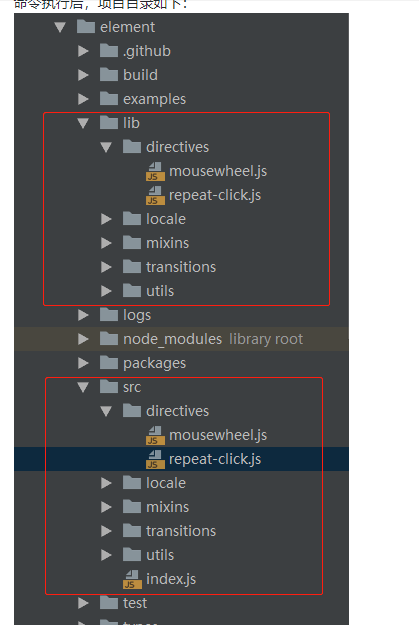

## build:file

* 执行node build/bin/iconInit.js & node build/bin/build-entry.js & node build/bin/i18n.js & node build/bin/version.js
* 生成各种新文件icon,index,i18n,version
* [build:file](https://juejin.im/post/5bcd95bc6fb9a05d2272db74)

## build:utils
- "build:utils": "cross-env BABEL_ENV=utils babel src --out-dir lib --ignore src/index.js",
- 这条命令的作用：设置环境变量 process.env.BABEL_ENV的值为utils，同时用babel命令编译整个src文件夹，并且将结果输出到lib文件夹下，lib不会去覆盖原来lib下的内容，编译时忽略'src/index.js'文件
- .babelrc中有相关配置,可转义es6

## build:umd
* 将语言包重新编译,生成umd格式的文件

## build:theme
- "build:theme": "node build/bin/gen-cssfile && gulp build --gulpfile packages/theme-chalk/gulpfile.js && cp-cli packages/theme-chalk/lib lib/theme-chalk",
- 先生成scss文件,然后打包theme-chalk下的scss,最后做copy文件

## build:i18n
* 生成不同语言版本的文档;
* 利用node,读取配置文件,然后replace对应的关键字
* 最后输出文档

## 按需加载介绍
* [element按需加载](https://segmentfault.com/a/1190000015884948)

## makefile使用
- element使用makefile命令来生成相关文件
- el使用的是mackfile作为管理工程,这个文件一般是c++管理项目用的
- [win10 使用makefile命令](https://blog.csdn.net/pdcxs007/article/details/8582559)

> 安装make工具，已上传到百度网盘-html工具中 下载安装，安装完后需要添加相应的环境变量 默认：C:\Program Files (x86)\GnuWin32\bin 这样就可以使用make命令了

>  例如 make new dialog 就会创建相关的一系列文件出来

> make new name ['中文名称'],会生成相关文件
* 会使用node启动node build/bin/new.js生成文件
- components.json添加成文件路径
- packages>生成对应模块文件
- packages>theme-chalk>src 添加样式文件
- types>生成对应.ts文件
- test>unit>specs 生成对应的测试脚本
- examples>nav.config.json 添加路由文件
- examples>docs>zh-CN 生成对应的.md文件