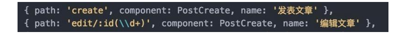

# 基础

## 参考系统
[vue-element-admin-site](https://panjiachen.github.io/vue-element-admin-site/zh/guide/)

## element-ui使用技巧
---

 > el-select获取label值 
``` js
<el-select v-model="value" ref="select" placeholder="请选择"></el-select>
//获取
this.$ref.select.selectLabel
```
> el-table 在flex容器下不会随窗口变化而变化

## vue使用技巧
* 安装tyarn  npm i -g yarn tyarn 

* router-view

Different router the same component vue。 真实的业务场景中，这种情况很多。比如



我创建和编辑的页面使用的是同一个 component，默认情况下当这两个页面切换时并不会触发 vue 的 created 或者 mounted 钩子，官方说你可以通过 watch $route 的变化来做处理，但其实说真的还是蛮麻烦的。后来发现其实可以简单的在 router-view 上加上一个唯一的 key，来保证路由切换时都会重新渲染触发钩子了。这样简单的多了。
``` js
<router-view :key="key"></router-view>

computed: {
  key() {
    // 或者 :key="route.fullPath" 只要保证key唯一就可以了
    return this.$route.name !== undefined? this.$route.name + +new Date(): this.$route + +new Date()
  }
 }
 ```


# 性能优化  