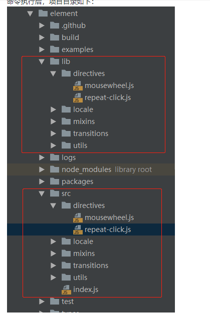

## 目录结构

<details>
<summary>vue-router代码</summary>

```js
├── build //打包命令
│   ├── bin 
│   │   ├── build-entry.js //生成组件index.js文件
│   │   ├── build-locale.js //国际化语言打包----暂不去了解
│   │   ├── gen-cssfile.js //生成packages/theme-chalk下的scss文件
│   │   ├── gen-indices.js //解析doc的md文件,生成algoliasearch的搜索
│   │   ├── i18n.js //生成api官网不同语言,
│   │   ├── iconInit.js //生成icon列表
│   │   ├── new.js //创建一个新的组件
│   │   ├── new-lang.js //创建新的语言
│   │   ├── template.js //在线
│   │   └── version.js //产出项目版本
│   ├── config.js //打包的一些工具方法
│   ├── deploy-ci.sh
│   ├── deploy-faas.sh
│   ├── gen-single-config.js //产出一些先关配置
│   ├── git-release.sh
│   ├── md-loader //md相关解析
│   │   ├── config.js
│   │   ├── containers.js
│   │   ├── fence.js
│   │   ├── index.js
│   │   └── util.js
│   ├── release.sh
│   ├── webpack.common.js //common打包,全部组件都打包成一个js
│   ├── webpack.component.js //组件单独打包
│   ├── webpack.conf.js //umd打包,生成index文件
│   ├── webpack.demo.js //演示打包
│   └── webpack.test.js //测试打包
├── CHANGELOG.zh-CN.md
├── components.json  //全部组件目录
├── element_logo.svg //logo
├── examples //例子,可在线运行
│   ├── app.vue
│   ├── assets
│   ├── bus.js
│   ├── color.js
│   ├── components
│   ├── demo-styles
│   ├── docs
│   ├── dom
│   ├── entry.js //dev入口文件
│   ├── favicon.ico
│   ├── i18n 
│   ├── icon.json
│   ├── index.tpl //模板
│   ├── nav.config.json //侧边导航
│   ├── pages //显示的内容
│   ├── play //单个组件测试
│   ├── play.js
│   ├── route.config.js //路由配置
│   ├── util.js
│   └── versions.json //记录先关版本
├── FAQ.md 
├── LICENSE
├── Makefile //make 命令
├── package.json
├── packages //组件目录
│   ├── dialog
│   ├── file-upload
│   ├── icon
│   ├── pagination
│   ├── region-picker
│   ├── table-tree
│   └── theme-chalk
├── README.md
├── src  //工具文件
│   ├── directives
│   ├── index.js
│   ├── locale
│   ├── mixins
│   ├── transitions
│   └── utils
├── test //测试文件
│   └── unit
├── types //先关ts
│   ├── component.d.ts
│   ├── dialog.d.ts
│   ├── file-upload.d.ts
│   ├── icon.d.ts
│   ├── pagination.d.ts
│   ├── region-picker.d.ts
│   └── table-tree.d.ts
└── yarn.lock
```

</details>


## 打包过程

### build:file

* 执行node build/bin/iconInit.js & node build/bin/build-entry.js & node build/bin/i18n.js & node build/bin/version.js
* 生成各种新文件icon,index,i18n,version
* [build:file](https://juejin.im/post/5bcd95bc6fb9a05d2272db74)


### build:utils
- "build:utils": "cross-env BABEL_ENV=utils babel src --out-dir lib --ignore src/index.js",
- 这条命令的作用：设置环境变量 process.env.BABEL_ENV的值为utils，同时用babel命令编译整个src文件夹，并且将结果输出到lib文件夹下，lib不会去覆盖原来lib下的内容，编译时忽略'src/index.js'文件
- .babelrc中有相关配置,可转义es6



### build:umd
* 将语言包重新编译,生成umd格式的文件


### build:theme
- "build:theme": "node build/bin/gen-cssfile && gulp build --gulpfile packages/theme-chalk/gulpfile.js && cp-cli packages/theme-chalk/lib lib/theme-chalk",
- 先生成scss文件,然后打包theme-chalk下的scss,最后做copy文件

### build:i18n
* 生成不同语言版本的文档;
* 利用node,读取配置文件,然后replace对应的关键字
* 最后输出文档

### 按需加载介绍
* [element按需加载](https://segmentfault.com/a/1190000015884948)


### makefile使用
- element使用makefile命令来生成相关文件
- el使用的是mackfile作为管理工程,这个文件一般是c++管理项目用的
- [win10 使用makefile命令](https://blog.csdn.net/pdcxs007/article/details/8582559)

> 安装make工具，已上传到百度网盘-html工具中 下载安装，安装完后需要添加相应的环境变量 默认：C:\Program Files (x86)\GnuWin32\bin 这样就可以使用make命令了

>  例如 make new dialog 就会创建相关的一系列文件出来

> make new name ['中文名称'],会生成相关文件
* 会使用node启动node build/bin/new.js生成文件
- components.json添加成文件路径
- packages>生成对应模块文件
- packages>theme-chalk>src 添加样式文件
- types>生成对应.ts文件
- test>unit>specs 生成对应的测试脚本
- examples>nav.config.json 添加路由文件
- examples>docs>zh-CN 生成对应的.md文件


## 代码解析
* [Element-UI 技术揭秘（2）- 组件库的整体设计](https://juejin.im/post/5d64fa0af265da03cd0a8e7f?utm_source=gold_browser_extension)
* [webpack 应用编译优化之路](https://juejin.im/post/59dc57f2f265da431d3ba2ef)